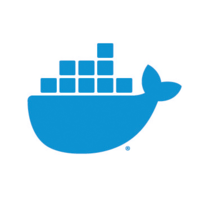
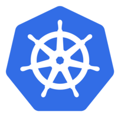

## Hi there 👋

#### I am a Java Backend Engineer.

##### ABOUT ME

- :philippines: Filipino
- :dart: Certified Kubernetes Application Developer (CKAD)
- :dart: Professional Scrum Master I (PSM I)
- :sunglasses: TDD Practitioner and DevOps-oriented
- :zap: Fun fact: I'm a huge Martin Garrix and Coldplay fan!
- :seedling: Currently learning Observability and Data Engineering

##### OPEN-SOURCE CONTRIBUTIONS

- Spring Data Redis
  - https://github.com/spring-projects/spring-data-redis/pull/2118
- Spring Batch
  - https://github.com/spring-projects/spring-batch/pull/4377  

##### TECH BLOGS
- [Geospatial indexing app with different backends using Spring Boot and Testcontainers](https://link.medium.com/N2vaTzhUgnb)

#### Backend Stack

<code></code>
<code></code>
<code></code>
<code></code>
<code></code>
<code></code>
<code></code>
<code></code>
<code></code>

#### Testing Stack

<code></code>
<code></code>
<code></code>
<code></code>
<code></code>

#### CI/CD Stack

<code></code>
<code></code>
<code></code>
<code></code>
<code></code>
<code></code>

#### Cloud Stack

<code></code>
<code></code>
<code></code>
<code></code>
<code></code>
<code></code>
<code></code>
<code></code>

#### Mobile Stack

<code></code>
<code></code>

#####  [View on Stack Share](https://stackshare.io/morenomjc/backend-stack)

#### Stats

